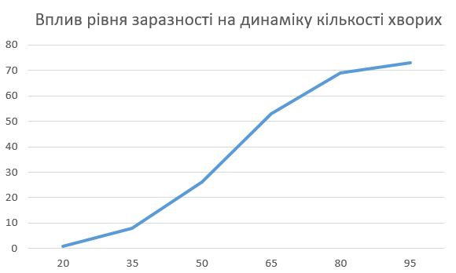
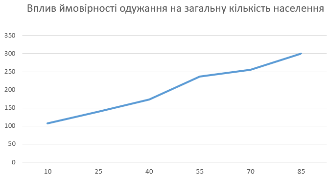
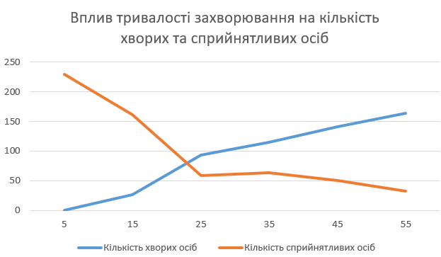

## Комп'ютерні системи імітаційного моделювання
## СПм-24-1, **Салєєв Владислав Олександрович**
### Лабораторна робота №**1**. Опис імітаційних моделей та проведення обчислювальних експериментів

 

### Варіант 3, модель у середовищі NetLogo:
[Virus](https://www.netlogoweb.org/launch#https://www.netlogoweb.org/assets/modelslib/Sample%20Models/Biology/Virus.nlogo). Модель поширення захворювання у людській популяції.

 

### Вербальний опис моделі:
Модель відтворює процес передачі та поширення вірусу в людській популяції. Кожна людина подається як окремий агент, що дозволяє спостерігати за динамікою епідемії у замкнутому середовищі з фіксованою кількістю учасників.
Основою моделі є низка факторів, описаних екологічними біологами у статті _“Seasonality and the requirements for perpetuation and eradication of viruses in populations”_. Ці фактори впливають на виживання та циркуляцію вірусу, що передається прямим шляхом, у межах популяції.

### Керуючі параметри:
- **number-people** — початкова кількість агентів у моделюванні, тобто кількість людей у замкнутому середовищі.
- **infectiousness** — імовірність передачі вірусу при контакті інфікованої та сприйнятливої особи.
- **chance-recover** — шанс одужання інфікованого та, відповідно, формування імунітету.
- **duration** — час, протягом якого особа залишається хворою перед переходом до стану одужання або смерті.
- **turtle-shape** — графічне представлення агентів у GUI. Використання кругів спрощує візуальне виявлення їх перекриття та взаємодій.

### Внутрішні параметри:
- **%immune** — частка осіб з імунітетом серед загальної популяції.
- **%infected** — відсоток інфікованих на поточний момент часу (останній симуляційний тиждень).
- **lifespan** — максимальний вік агента.
- **carrying-capacity** — максимальна кількість людей, яку може «вмістити» середовище.
- **chance-reproduce** — імовірність народження потомства здоровою особою.
- **immunity-duration** — період дії імунітету після одужання.

### Показники роботи системи:
- мінімальна кількість інфікованих у процесі моделювання;
- максимальна кількість осіб з імунітетом;
- пік епідемії — найбільша кількість одночасно заражених;
- середня максимальна кількість здорових людей;
- число смертей за певний проміжок часу;
- факт перевищення кількості хворих над кількістю здорових;
- стійкість вірусу — тривалість часу, протягом якого кількість інфікованих > 0.

#### Алгоритм зміни станів моделі
Початкові умови: у «світі» перебуває 150 осіб, з них 10 — інфіковані.  
Агенти переміщуються випадковим чином та можуть мати один із трьох станів:
- **здоровий, сприйнятливий** (зелений);
- **інфікований та заразний** (червоний);
- **здоровий з імунітетом** (сірий).
Агенти можуть помирати від інфекції або внаслідок старіння у віці 50 років. Якщо чисельність населення стає меншою за встановлену ємність середовища (300 у даній моделі), то здорові агенти можуть відтворювати потомство згідно параметра **chance-reproduce**. Нові агенти з’являються здоровими, але сприйнятливими до вірусу.

### Недоліки та потенційні зміни до логіки моделі:

- Модель передбачає отримання імунітету виключно після перенесення хвороби. Можна додати механізм вакцинації.
- Наразі кожен здоровий агент має сталу ймовірність розмноження (1% раз на тиждень), незалежно від віку чи інших факторів. Логіку відтворення доцільно адаптувати: враховувати віковий діапазон, фертильний період та інтервал між народженнями.
- Модель симулює лише прямий шлях передачі інфекції (контакт, рідини, дихання). Реалістичнішим було б додати інші механізми:
    - зараження через поверхні;
    - можливість передачі через переносників.
- Середня тривалість життя агента (50 років) не відповідає реальним даним (73 роки). 
- В моделі відсутній інкубаційний період — інфікована людина одразу стає заразною. Додавання перехідного стану дозволить:
    - розділити інфікованих на тих, хто ще не проявляє симптомів,
    - змінити ймовірність зараження в залежності від стадії хвороби.
 

## Обчислювальні експерименти

### 1. Вплив рівня заразності (infectiousness) на динаміку кількості хворих
Метою експерименту є дослідження того, як зміна параметра **infectiousness** впливає на середню кількість інфікованих осіб протягом певного періоду часу. У межах моделювання оцінюється динаміка поширення інфекції впродовж **1 року (52 тижнів)** для різних значень цього параметра, що дозволяє визначити його роль у формуванні епідемічної кривої та інтенсивності передачі вірусу.

Експеримент проводиться при загальних значеннях керуючих змінних: 
- infectiousness: від 20% до 95% з кроком 15 (всього 6 симуляцій)
- chance-recover: 75%
- duration: 20 weeks

<table>
<thead>
<tr><th>№</th><th>Значення заразності (%)</th><th>Середня кількість хворих осіб</th></tr>
</thead>
<tbody>
<tr><td>1</td><td>20</td><td>1</td></tr>
<tr><td>2</td><td>35</td><td>8</td></tr>
<tr><td>3</td><td>50</td><td>26</td></tr>
<tr><td>4</td><td>65</td><td>53</td></tr>
<tr><td>5</td><td>80</td><td>69</td></tr>
<tr><td>6</td><td>95</td><td>73</td></tr>
</tbody>
</table>

З результатів експерименту видно, що зі зростанням рівня заразності параметра _infectiousness_ середня кількість хворих істотно підвищується. При низькій заразності (20–35%) поширення вірусу залишається мінімальним, тоді як значення 50% і вище призводять до суттєвого збільшення захворюваності. Проте на дуже високих значеннях (80–95%) темп зростання сповільнюється: система виходить на насичення, а пік інфікованих зменшується. Це пояснюється тим, що за таких умов значна частина популяції дуже швидко інфікується, одужує та переходить у стан імунітету, що обмежує подальше поширення вірусу та стримує зростання кількості хворих.

### 2. Вплив ймовірності одужання (chance-recover) на загальну кількість населення

Метою експерименту є дослідження того, як зміна параметра **chance-recover** впливає на загальну кількість населення протягом певного часу. У межах моделювання оцінюється динаміка поширення інфекції впродовж **2 років (104 тижні)** для різних значень цього параметра, що дозволяє визначити його роль у формуванні чисельності популяції, рівня смертності та накопичення імунних осіб.

Експеримент проводиться при загальних значеннях керуючих змінних: 
- infectiousness: 65%
- chance-recover: від 10% до 85% з кроком 15 (всього 6 симуляцій)
- duration: 20 weeks

<table>
<thead>
<tr><th>№</th><th>Значення ймовірності одужання (%)</th><th>Загальна кількість населення</th></tr>
</thead>
<tbody>
<tr><td>1</td><td>10</td><td>107</td></tr>
<tr><td>2</td><td>25</td><td>139</td></tr>
<tr><td>3</td><td>40</td><td>173</td></tr>
<tr><td>4</td><td>55</td><td>236</td></tr>
<tr><td>5</td><td>70</td><td>256</td></tr>
<tr><td>6</td><td>85</td><td>300</td></tr>
</tbody>
</table>

Результати експерименту демонструють, що підвищення ймовірності одужання (**chance-recover**) суттєво впливає на загальну чисельність населення. При низькому шансі одужання (10–25%) чисельність населення залишається значно нижчою за максимально можливу, що свідчить про високий рівень смертності через інфекцію. Зі зростанням **chance-recover** від 40% до 85% кількість населення збільшується і наближається до максимальної ємності середовища (300 осіб), оскільки більше індивідів одужує і набуває імунітету. Це підтверджує ключову роль параметра одужання у збереженні населення та обмеженні негативного впливу епідемії на популяцію. 

### 3. Вплив середньої тривалості одужання (duration) на кількість спринятливих та хворих осіб
Метою експерименту є дослідження того, як **зміна параметра duration**, що визначає середню тривалість одужання, впливає на **кількість сприйнятливих (susceptible)** та **хворих (infected)** осіб у популяції. Протягом моделювання аналізується динаміка цих двох груп за період **1 року (52 тижні)** для різних значень duration. Це дозволяє оцінити, як швидкість одужання хворих осіб впливає на можливість подальшого поширення інфекції та загальний баланс між здоровими й інфікованими членами популяції.

Експеримент проводиться при загальних значеннях керуючих змінних: 
- infectiousness: 65%
- chance-recover: 75%
- duration: від 5 до 55 з кроком 10 (всього 6 симуляцій)

<table>
<thead>
<tr>
<th>№</th>
<th>Тривалість</th>
<th>Кількість хворих осіб</th>
<th>Кількість сприйнятливих осіб</th>
</tr>
</thead>
<tbody>
<tr>
<td>1</td>
<td>5</td>
<td>0</td>
<td>230</td>
</tr>
<tr>
<td>2</td>
<td>15</td>
<td>26</td>
<td>161</td>
</tr>
<tr>
<td>3</td>
<td>25</td>
<td>93</td>
<td>59</td>
</tr>
<tr>
<td>4</td>
<td>35</td>
<td>115</td>
<td>64</td>
</tr>
<tr>
<td>5</td>
<td>45</td>
<td>141</td>
<td>50</td>
</tr>
<tr>
<td>6</td>
<td>55</td>
<td>163</td>
<td>33</td>
</tr>
</tbody>
</table>

Експеримент показав, що зі збільшенням тривалості одужання кількість хворих зростає, а число сприйнятливих осіб різко зменшується. За короткого duration (5 тижнів) хворих майже немає, тоді як при максимальному значенні (55 тижнів) їх стає найбільше. Це свідчить про те, що довше одужання призводить до стійкішого та тривалішого поширення інфекції, оскільки хворі залишаються інфекційними протягом більшого часу.
