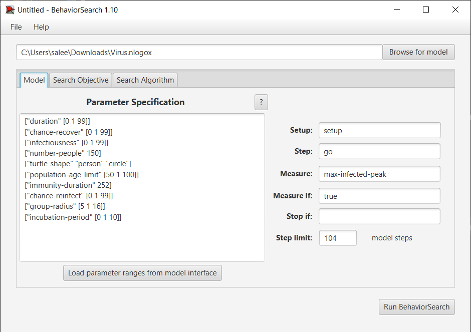
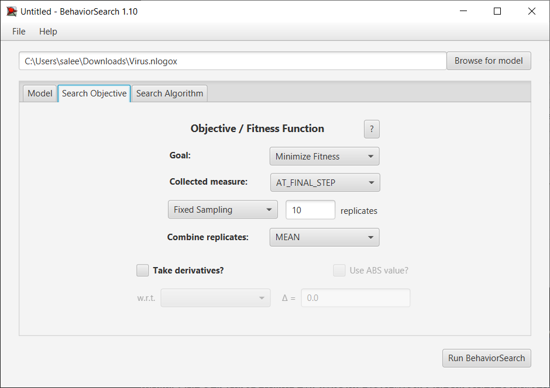
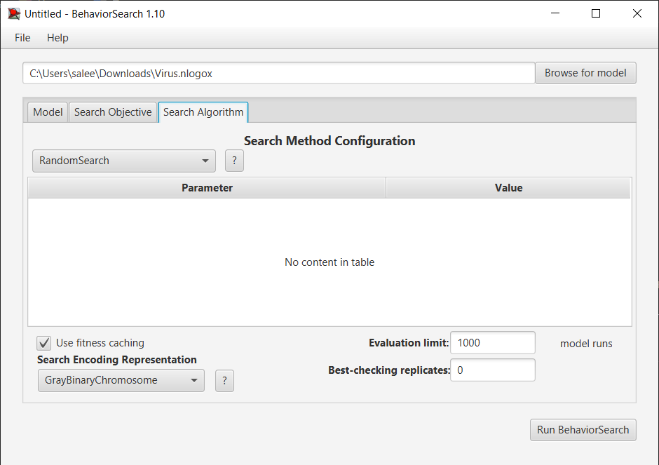
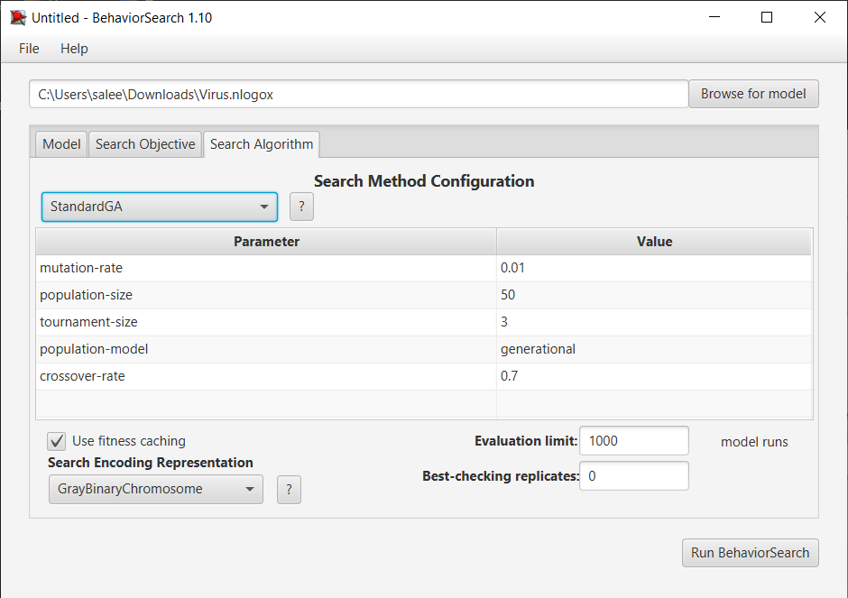
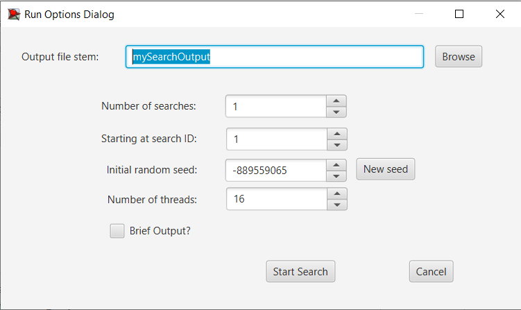
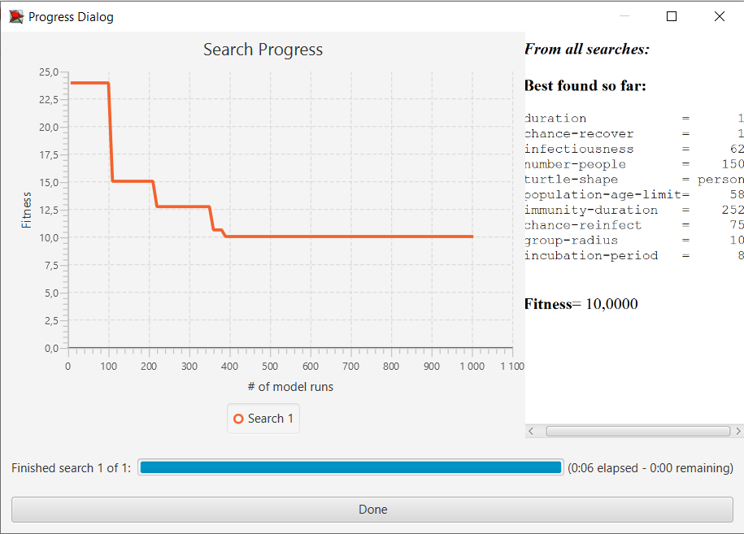
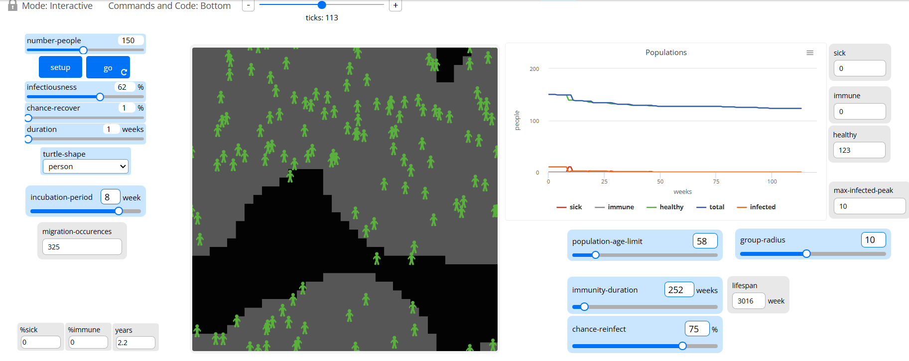
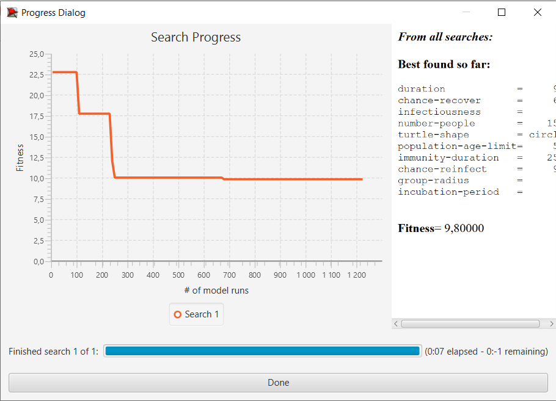
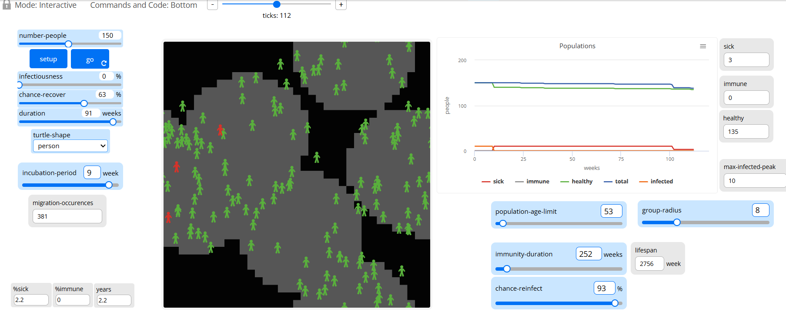

## Комп'ютерні системи імітаційного моделювання
## СПм-24-1, **Салєєв Владислав Олександрович**
### Лабораторна робота №**3**. Використання засобів обчислювального інтелекту для оптимізації імітаційних моделей

<br>

### Варіант 3, модель у середовищі NetLogo:
[Virus](https://www.netlogoweb.org/launch#https://www.netlogoweb.org/assets/modelslib/Sample%20Models/Biology/Virus.nlogo). Модель поширення захворювання у людській популяції.

<br>

### Вербальний опис моделі:
Модель імітує процес передачі та поширення вірусу в людській популяції, де кожна людина представлена як агент, що дозволяє дослідити можливу динаміку розвитку епідемії у часі. Населення поділено на п’ять груп, які випадковим чином розміщуються в межах досліджуваного середовища. Між групами існує можливість міграції: окремий індивід може змінювати належність до будь-якої іншої групи. У моделі діє обмеження на максимальну кількість агентів, що одночасно можуть існувати у замкнутому середовищі. На поширення та виживання вірусу в популяції впливають різні фактори: заразність патогена, тривалість захворювання та інкубаційного періоду, шанс одужання, віковий ліміт існування особи, тривалість набутого імунітету та ймовірність повторного зараження після одужання.


### Керуючі параметри:
- **number-people** — початкова чисельність агентів у середовищі моделювання.
- **infectiousness** — імовірність передачі вірусу при контакті інфікованої та сприйнятливої особи на одній клітинці.
- **chance-recover** — ймовірність одужання хворого індивіда, яка визначає частку осіб, що набувають імунітет.
- **duration** — тривалість перебування в стані хвороби перед завершенням (одужанням або смертю).
- **turtle-shape** — форма відображення агентів у графічному інтерфейсі (використання кругів спрощує візуальне спостереження за контактом між агентами).
- **incubation-period** — тривалість інкубаційного періоду перед появою симптомів.
- **population-age-limit** — максимальна можлива тривалість життя агента.
- **immunity-duration** — час, протягом якого зберігається імунітет після одужання.
- **chance-reinfect** — імовірність повторного зараження після втрати імунітету або у випадку рецидиву.
- **group-radius** — радіус регіонів (п’яти груп населення), що випадковим чином розміщені у середовищі.

### Внутрішні параметри:
- **%immune** — частка осіб з імунітетом серед загальної популяції.
- **%infected** — відсоток інфікованих на поточний момент часу (останній симуляційний тиждень).
- **lifespan** — максимальний вік агента.
- **carrying-capacity** — максимальна кількість людей, яку може «вмістити» середовище.
- **chance-reproduce** — імовірність народження потомства здоровою особою.
- **immunity-duration** — період дії імунітету після одужання.

### Показники роботи моделі:
- **%infected** — частка інфікованих агентів у популяції.
- **%immune** — частка осіб з імунітетом.
- **migration-occurences** — кількість реалізованих переходів між групами.
- **population size** — поточна чисельність агентів у середовищі.
- **death count** — кількість осіб, що загинули від хвороби.
- **recovered count** — кількість тих, що одужали.


## Налаштування середовища BehaviorSearch

**Обрана модель**:

```
C:\Users\salee\Downloads\Virus.nlogox
```

**Параметри моделі (вкладка Model):**

Для дослідження оптимальних налаштувань динаміки поширення вірусу були обрані такі параметри:

```
["duration" [0 1 99]]
["chance-recover" [0 1 99]]
["infectiousness" [0 1 99]]
["number-people" 150]
["turtle-shape" "person" "circle"]
["population-age-limit" [50 1 100]]
["immunity-duration" 252]
["chance-reinfect" [0 1 99]]
["group-radius" [5 1 16]]
["incubation-period" [0 1 10]]
```

Параметри, представлені діапазонами, змінювалися BehaviorSearch у встановлених межах. Фіксованими залишилися початкова кількість агентів, форма відображення та тривалість імунітету.

**Фітнес-функція (Measure)**

Для оцінювання результатів кожної симуляції було використано показник:  
**максимальна кількість одночасно інфікованих осіб**.

Для цього до NetLogo-моделі додано змінну:

```
max-infected-peak
```

Максимальне значення інфікованих визначається протягом усіх 104 тактів моделювання  
(припущення: **1 такт = 1 тиждень**, загальна тривалість = **2 роки**).  
Умови дострокового завершення «Stop if» не застосовувалися.
У вкладці налаштувань BehaviorSearch відображено параметри моделі з заданими діапазонами варіювання та обрану метрику — **`max-infected-peak`**:



## **Налаштування цільової функції (вкладка _Search Objective_)**

Метою оптимізації параметрів імітаційної моделі розповсюдження вірусу у популяції (поділеної на декілька груп) є **мінімізація максимальної кількості хворих осіб одночасно**. У полі **Goal** обрано значення **Minimize Fitness**, що означає пошук таких параметрів моделі, за яких пік захворюваності буде найменшим.

Оскільки цільовий показник повинен враховуватися **на завершальному кроці симуляції**, у полі **Collected measure** встановлено опцію **AT_FINAL_STEP**.

Для зменшення впливу стохастичних факторів моделі (випадковий рух агентів та випадкове зараження), кожна комбінація налаштувань моделі виконується **10 разів**, а значення фітнес-функції обчислюється як **середнє арифметичне** отриманих пікових значень.



## **Налаштування алгоритму пошуку (вкладка _Search Algorithm_)**

У BehaviorSearch для порівняння використовувалися два алгоритми:

- **випадковий пошук (Random search)**,
- **генетичний алгоритм (GA)**.

Обидва алгоритми виконували **до 1000 симуляцій**, після чого порівнювалися значення фітнес-функції.

**Загальний вигляд вкладки налаштувань алгоритму RandomSearch:**



**Загальний вигляд вкладки налаштувань алгоритму Standard GA:**



## **Результати використання BehaviorSearch**

### **Запуск пошуку**

Для запуску оптимізації використовувалося стандартне діалогове вікно.  
Виконано пошук параметрів моделі окремо для **випадкового пошуку** та **генетичного алгоритму**.

Діалогове вікно запуску пошуку:



### **Результати випадкового пошуку**

Алгоритм випадкового пошуку визначив набори значень, що забезпечують **максимальний пік хворих 10 осіб** . Найкраще значення досягалося приблизно на **380-й ітерації**, тобто виконання 1000 прогонів було надлишковим.



**Найкращий набір параметрів (Random search):**

```
duration = 1  
chance-recover = 1  
infectiousness = 62  
number-people = 150  
turtle-shape = person  
population-age-limit= 58  
immunity-duration = 252  
chance-reinfect = 75  
group-radius = 10  
incubation-period = 8
```

Перевірка в NetLogo:



За цих налаштувань вірус зникає менш ніж за два роки, а пікове значення не перевищує **10**.

### **Результати генетичного алгоритму**

Генетичний алгоритм дозволив отримати **трохи кращий результат** за мінімізованим значенням — на рівні 9.8, проте різниця є несуттєвою для моделі, де цільовий показник має дискретну природу (кількість людей).

Досягнення значення піку **10 осіб** спостерігалося вже на **230-й ітерації**, що приблизно на **150 ітерацій швидше**, ніж у випадковому пошуку, що підтверджує більш високу ефективність GA.



**Найкращий набір параметрів (Genetic Algorithm):**

```
duration = 91  
chance-recover = 63  
infectiousness = 0  
number-people = 150  
turtle-shape = circle  
population-age-limit= 53  
immunity-duration = 252  
chance-reinfect = 93  
group-radius = 8  
incubation-period = 9
```

Перевірка в NetLogo:



При цих параметрах вірус також зникає менш ніж за два роки, а пікове значення не перевищує **10 осіб**.