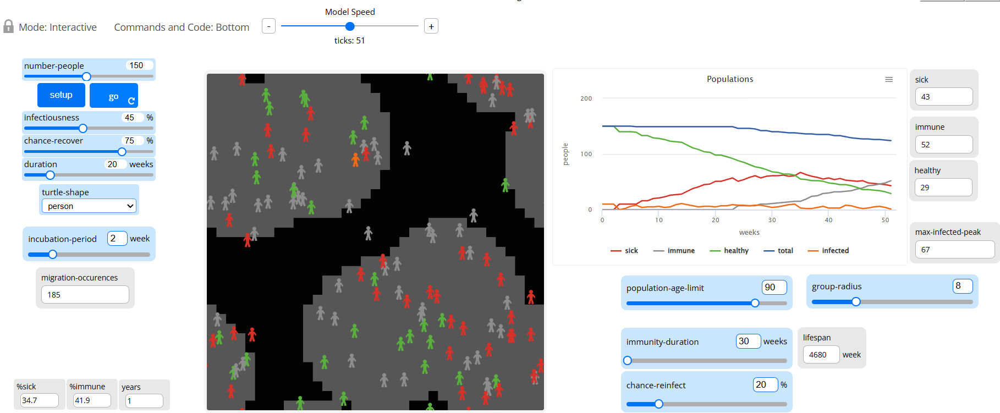

## Комп'ютерні системи імітаційного моделювання
## СПм-24-1, **Салєєв Владислав Олександрович**
### Лабораторна робота №**2. Редагування імітаційних моделей у середовищі NetLogo

<br>

### Варіант 3, модель у середовищі NetLogo:
[Virus](https://www.netlogoweb.org/launch#https://www.netlogoweb.org/assets/modelslib/Sample%20Models/Biology/Virus.nlogo). Модель поширення захворювання у людській популяції.

Завдання: Додати вплив віку на інфікування та результат захворювання. Додати вплив ступеня поширення захворювання (поточного відсотка інфікованих) на вірогідність появи нових агентів. Додати можливість регулювання тривалості імунітету та вірогідності захворіти повторно.
<br>
### Внесені зміни у вихідну логіку моделі, за варіантом:
Модель відтворює процес передачі та поширення вірусу в людській популяції. Кожна людина подається як окремий агент, що дозволяє спостерігати за динамікою епідемії у замкнутому середовищі з фіксованою кількістю учасників.
Основою моделі є низка факторів, описаних екологічними біологами у статті _“Seasonality and the requirements for perpetuation and eradication of viruses in populations”_. Ці фактори впливають на виживання та циркуляцію вірусу, що передається прямим шляхом, у межах популяції.

1.**Додавання впливу віку на інфікування та результат захворювання.**

У процедуру _infect_ було включено віковий коефіцієнт **age-factor**, який впливає на заразність. Це зроблено з припущення, що ризик інфікування змінюється залежно від віку: молодші особи менш вразливі, тоді як середній і старший вік підвищує ймовірність захворювання.

```NetLogo
to infect ;; turtle procedure  
  ask other turtles-here with [ not sick? and not immune? ]  
    [  
    let age-factor 1  
    if age > 30 and age < 45 [ set age-factor 1.2 ];; middle-aged higher risk  
    if age < 20 [ set age-factor 0.7 ]            ;; young lower risk  
    if age > 60 [ set age-factor 1.5 ]            ;; older also higher risk  
    if random-float 100 < (infectiousness * age-factor)  
      [ get-sick ] ]
end
```

Оскільки ймовірність одужання у моделі визначено як загальнопопуляційний параметр і не залежить від конкретного агента, коригування було внесено до процедури _recover-or-die_. Тут шанс одужання зменшується пропорційно до віку та вікового коефіцієнта:

```NetLogo
to recover-or-die ;; turtle procedure
  if sick-time > duration [
    let adjusted-recover chance-recover - ((age / lifespan) * age-factor)

    ;; обмеження значення в межах 0–100
    if adjusted-recover < 0   [ set adjusted-recover 0 ]
    if adjusted-recover > 100 [ set adjusted-recover 100 ]

    ;; вибір результату на основі скоригованого шансу одужання
    ifelse random-float 100 < adjusted-recover
      [ become-immune ]
      [ die ]
  ]
end
```

Це відповідає формулі:

**EffectiveRecoveryChance = chanceRecover − (age / lifespan × ageFactor)**

Формула зменшує початкову ймовірність одужання, пропорційно віку агента та його віковій групі. Молоді агенти втрачають мало або зовсім не втрачають шансів, а старші — суттєво.

Крім того, у моделі враховано зміну тривалості життя популяції. Для цього було додано окрему процедуру, яка щоразу обчислює віковий коефіцієнт для кожного агента:

```NetLogo
to update-dynamics
  ask turtles [
    set age-factor 1
    if age > 30 and age < 45 [ set age-factor 1.2 ]
    if age < 20             [ set age-factor 0.7 ]
    if age > 60             [ set age-factor 1.5 ]
  ]
end
```

2.**Додати вплив ступеня поширення захворювання (поточного відсотка інфікованих) на вірогідність появи нових агентів.**

Згідно з умовою моделі розмноження можливе лише для здорових агентів. Проте під час епідемії логічно обмежити народження нового потомства, тому в процедуру _reproduce_ було додано залежність від поточної частки інфікованих:

```NetLogo
to reproduce
  if count turtles < carrying-capacity
     and random-float 100 < chance-reproduce
     and %infected < 50
  [
    hatch 1
    [
      set age 1
      lt 45 fd 1
      get-healthy
    ]
  ]
end
```

Отже, якщо хворіє **кожен другий мешканець**, розмноження повністю призупиняється.

3.**Додавання можливості керувати тривалістю імунітету та ймовірністю повторного зараження.**

У базовій моделі вже існувала опція повторного інфікування: тривалість імунітету була фіксованою та дорівнювала **52 тижням**:

```NetLogo
set immunity-duration 52
```

Після завершення цього періоду агент знову міг захворіти з початковою ймовірністю, а індивіди з активним імунітетом були повністю захищені.

Однак на практиці тривалість імунітету суттєво відрізняється залежно від хвороби. Тому до моделі додано **динамічний параметр**, що визначається з урахуванням тривалості життя популяції.

Беручи до уваги визначення рецидиву (повторне повернення симптомів через те, що збудник не був повністю усунений з організму), процедура **recover-or-die** була модифікована:

```NetLogo
to recover-or-die-or-recidere ;; turtle procedure
  if sick-time > duration [
    let adjusted-recover chance-recover - ((age / lifespan) * age-factor)

    ;; обмеження значення ймовірності у межах 0–100
    if adjusted-recover < 0   [ set adjusted-recover 0 ]
    if adjusted-recover > 100 [ set adjusted-recover 100 ]

    ;; результат події після лікування
    ifelse random-float 100 < adjusted-recover [
      
      ;; Агент одужує, але може мати рецидив
      ifelse random-float 100 < chance-reinfect
        [ recidere ]           ;; повернення хвороби
        [ become-immune ]      ;; нормальне формування імунітету

    ] [
      die
    ]
  ]
end

```

Таким чином, якщо імунітет не формується і спрацьовує шанс рецидиву, агент одразу переходить у стан повторного захворювання — фактично переживає «другий цикл хвороби». При цьому ідеалізація досконалого імунітету для тих, у кого він є, збережена.

### Внесені зміни у вихідну логіку моделі, на власний розсуд:

1.Модифікація логіки переміщення агентів

Оскільки зараження найчастіше відбувається під час безпосереднього контакту між людьми, модель розглядає замкнене середовище, де агенти легко взаємодіють та передають інфекцію. Проте у реальному світі населення поділене на умовні соціальні групи, між якими взаємодія може бути нерівномірною. Тому було вирішено додати структуру з окремих груп населення, між якими агенти можуть інколи переміщуватися.

У модель введено **п’ять умовних груп**, що зберігаються як глобальна змінна:
```
globals
  [ %infected
    %immune
    lifespan
    chance-reproduce
    carrying-capacity
    age-factor
    num-groups ]
```

Для кожного агента визначається власний _group-id_ та початкова позиція, прив’язана до центру групи. Замість випадкового розташування:

```
setxy random-xcor random-ycor
```

Запроваджено координатну формулу, яка рівномірно розподіляє агентів у межах області радіуса _R_ навколо центру групи:

```
set group-id random num-groups
let center item group-id group-centers
let cx item 0 center
let cy item 1 center

setxy (cx + random-float (group-radius * 2) - group-radius)
      (cy + random-float (group-radius * 2) - group-radius)
```

Процедура _move_ забезпечує перебування агентів у межах своєї групи: у разі віддалення вони прямують назад, а в зоні своєї групи — рухаються хаотично.

```
to move ;; turtle procedure
  let center item group-id group-centers
  let cx item 0 center
  let cy item 1 center
  let distance-to-center distancexy cx cy

  ;; Повернення до центру групи, якщо агент відійшов надто далеко
  if distance-to-center > group-radius [
    facexy cx cy
  ]

  ;; Інакше – випадкове переміщення
  rt random 30 - random 15
  fd 0.7 + random-float 0.3
end
```

Для моделювання рідкісних перетинів соціальних груп введено міграцію з фіксованою ймовірністю 3%. Також ведеться лічильник міграційних подій:

```
to migrate ;; turtle procedure
  if random-float 1 < migration-chance [
    let old-group-id group-id

    set group-id random num-groups
    if old-group-id != group-id [
      set migration-occurences migration-occurences + 1
    ]
  ]
end
```

2.Додавання вікової залежності до процесу розмноження

Спочатку кожен здоровий агент мав однаковий шанс (1% на тиждень) створити нащадка. Для реалістичності логіку відтворення змінено: тепер потомство можливе лише для дорослого населення репродуктивного віку та за умови помірного рівня зараження.

```
to reproduce ;; turtle procedure
  if count turtles < carrying-capacity and %infected < 33.3 [
    if random-float 100 < chance-reproduce
       and not sick?
       and age > 18
       and age < 50
    [
      hatch 1 [
        set age 1
        lt 45 fd 1
        get-healthy
      ]
    ]
  ]
end
```

Отже, розмноження тепер залежить від:
- стану здоров’я,
- рівня зараження популяції,
- віку агента,
- місткості середовища.

3.Додавання інкубаційного періоду

До набору змінних агента було введено два нових параметри:
- **incubation-time** — лічильник, що показує, скільки часу агент уже перебуває в інкубаційному стані;
- **incubation-period** — тривалість інкубаційного періоду, яка випадково визначається під час ініціалізації (аналогічно до механізму формування імунітету).

При створенні агента ці параметри отримують такі значення:

```
set incubation-time 0
set incubation-period 5 + random 5
```

Додатково в інтерфейс було внесено керовану змінну, щоб можна було експериментально перевіряти вплив різної тривалості інкубації на темпи поширення вірусу.

У модель додано окрему процедуру _get-infected_, яка активується, коли агент отримує вірус. У цьому стані він ще не є хворим:

```
to get-infected ;; turtle procedure
  set infected? true
  set sick? false
  set incubation-time 0
  set remaining-immunity 0
end
```

Таким чином, після зараження агент перебуває у прихованій фазі й не має імунітету.

У головному циклі моделі тепер передбачено обробку інкубаційної фази:

```
if infected? [
  progress-infection
]
```

Після завершення інкубаційного періоду агент переходить у стан _sick?_, а також починає відлік часу хвороби:

```
to progress-infection ;; turtle procedure
  set incubation-time incubation-time + 1
  if incubation-time > incubation-period [
    set sick? true
    set infected? false
    set sick-time 0
  ]
end
```

Тобто інкубаційний період реалізовано як прихована фаза, під час якої агент ще не проявляє симптомів і не вважається хворим, але рухається та взаємодіє як здоровий.

Для зручності спостереження за динамікою поширення інфекції змінено візуальне кодування різних станів:

```
to update-display
  ask turtles [
    if shape != turtle-shape [ set shape turtle-shape ]

    if sick?     [ set color red ]      ;; активна хвороба
    if infected? [ set color orange ]   ;; інкубаційний період
    if immune?   [ set color grey ]     ;; набутий імунітет

    ;; здорові — за кольором групи населення
    if not sick? and not immune? [
      set color item group-id [blue green yellow violet brown]
    ]
  ]
end
```

- **червоний** — хворі
- **помаранчевий** — інфіковані, ще без симптомів
- **сірий** — особи з імунітетом
- **зелений** — здорові

Зображення моделі під час симуляції після виконання усіх змін:


## Обчислювальні експерименти

В даному експерименті досліджується як швидко все населення може впоратись із хворобою в залежності від параметру вірогідності рецидиву (chance-reinfect).

Експеримент проводиться при загальних значеннях керуючих змінних: 
- infectiousness: 45%
- chance-recover: 75%
- duration: 20 weeks
- incubation-period: 2 weeks
- population-age-limit: 90
- group-radius: 8
- immunity-duration: 30 weeks
- chance-reinfect: від 0 до 100 з кроком 20 (6 симуляцій)

<table>
<thead>
<tr><th>№</th><th>Значення вірогідності рецедиву (%)</th><th>Кількість тижнів</th></tr>
</thead>
<tbody>
<tr><td>1</td><td>0</td><td>190</td></tr>
<tr><td>2</td><td>20</td><td>340</td></tr>
<tr><td>3</td><td>40</td><td>363</td></tr>
<tr><td>4</td><td>60</td><td>419</td></tr>
<tr><td>5</td><td>80</td><td>433</td></tr>
<tr><td>6</td><td>100</td><td>546</td></tr>
</tbody>
</table>


Результати експерименту показують, що зі зростанням вірогідності рецидиву тривалість подолання епідемії суттєво збільшується: при нульовому рецидиві популяція впоралася із хворобою за 190 тижнів, а за значень 20–80% час стабілізації поступово зростав до понад 430 тижнів. Максимальне значення параметра (100%) призвело до найбільш тривалої та виснажливої епідемії — 546 тижнів, причому при такій інтенсивності повторного зараження популяція не змогла відновитися та повністю вимерла від хвороби.


Загалом, після внесення змін та проведення експериментів, можна дійти висновку, що розроблена модель стала значно гнучкішою, реалістичнішою та здатною точніше відображати динаміку поширення хвороби. Водночас збільшення кількості вхідних та внутрішніх параметрів підвищило складність роботи з моделлю: для коректного аналізу результатів тепер необхідно враховувати більше взаємопов’язаних факторів і ретельніше підходити до планування експериментів.